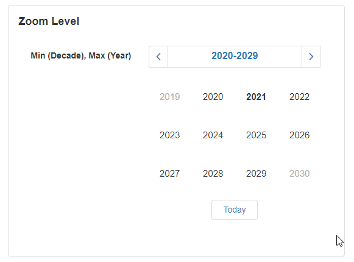

# Calendar

The Calendar is a Block that displays a Calendar and allows the user to select the required date within a specified date range. This is useful to use on forms where the user needs to enter a date for a particular field. It is also useful for displaying certain important dates to the user.&#x20;

> [!NOTE]
> Some images in this document may be missing and need to be migrated from the original GitBook documentation.

## Calendar Properties

### Appearance

#### Common Properties

You can specify if the Calendar is _visible_, or if _tooltips_ are enabled.

[See the Common Properties article for more details on common appearance properties.](../common-properties.md#appearance)

#### Show Today Button

This specifies if the button that takes the user back to the current date is displayed.&#x20;

#### Zoom Levels

This specifies the time frame of selectable dates. Options include month, year, decade, and century.

#### Min and Max Zoom Levels

This specifies the limit on where the user can zoom in and out of the dates. For example, they can zoom until they reach the page that shows the yearly view, and can only zoom out to see decades.

### Behavior

#### Common Properties&#x20;

The _read-only_ and _disabled_ properties are common to most Blocks;

[See the Common Properties article for more details on common behavior properties.](../common-properties.md#behavior)

#### Min and Max

This only lets the user select dates within a limited range.

#### First Day of the Week

Changes the day of the week that the Calendar starts on.

### Value

#### Common Properties

The Value property is common to most Blocks;

[See the Common Properties article for more details on common value properties.](../common-properties.md#behavior-1)

The accepted values for the Calendar include the selected date or time that the user clicks on. This can either be a date, number, or sequence of characters. The _Date_ option will accept the date directly. The _number_ option will accept the date using a timestamp. The _string_ option will accept the date as a sequence of characters provided they are in the correct format:

* "yyyy-MM-dd" (for example, "2017-03-06")
* "yyyy-MM-ddTHH:mm:ss" (for example, "2017-03-27T16:54:48")
* "yyyy-MM-ddTHH:mm:ssZ" (for example, "2017-03-27T13:55:41Z")
* "yyyy-MM-ddTHH:mm:ssx" (for example, "2017-03-27T16:54:10+03")

### Disabled Dates Data Source

#### Common Properties

If set to the _Dynamic Data Source_ option, additional options include _filtering, sorting, showing a number of results,_ and _skipping a number of results_.&#x20;

[See the Common Properties article for more details on common Data Source properties.](../common-properties.md#data-source)

#### Static Items

If a Dynamic Data Source is not used, you can enter key dates to display manually under the Data section.&#x20;

#### Dynamic Data Source

This option allows you to connect the control to a specific Data Source such as a database to pull data dynamically. This will give you additional options to sort, filter, show, or skip certain records. &#x20;

### Data

The data allows you to choose a _date_ based on the connected Data Source. This can be configured when using static items for disabled dates Data Sources.

### Action

#### Common Properties

Properties that are common to most Blocks include: _Navigate To and Show Confirmation Dialog;_

[See the Common Properties article for more details on common action properties.](../common-properties.md#action)
